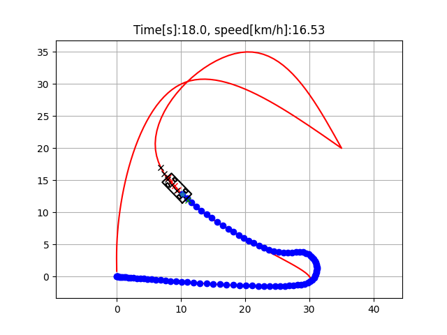

# MPC Path Tracking for Autonomous Vehicles
This project implements a Model Predictive Control (MPC) strategy to track reference trajectories for an autonomous ground vehicle modeled using a kinematic bicycle model. It provides a modular, simulation-based environment for testing trajectory tracking performance under various scenarios, including sharp turns, forward/backward motion, and switchbacks.



# Features
- Iterative linear MPC using cvxpy
- Nonlinear bicycle model vehicle dynamics
- Reference trajectory generation using cubic spline interpolation
- Speed profile computation based on direction and curvature
- Supports multiple test cases (straight paths, switchbacks, etc.)
- Real-time visualization of vehicle, predicted trajectory, and control inputs

# Background
Model Predictive Control (MPC) is an optimal control strategy that solves a finite horizon optimization problem at each time step, using a dynamic model of the system. It’s particularly effective in mobile robotics where constraints and nonlinearity must be handled in real time.

In this project:
- The vehicle is modeled using a kinematic bicycle model.
- MPC linearizes the model around the predicted trajectory and solves a constrained optimization problem to minimize deviations from the reference path and control effort.
- Control inputs (acceleration and steering) are then applied iteratively.

# Requirements
```bash
pip install numpy matplotlib cvxpy
```
# Results
The simulation window shows:

- Actual trajectory of the vehicle
- MPC predicted trajectory over the time horizon
- Target points on the reference trajectory
- Real-time vehicle pose and heading visualization

It also plots:
- Velocity over time
- Tracking performance against reference path

# Inference from Results
- The MPC controller effectively tracks complex paths like switchbacks and reverse turns by dynamically adjusting acceleration and steering.
- The reference trajectory smoothing and yaw angle correction reduce oscillations during aggressive maneuvers.
- Performance is sensitive to tuning weights (Q, R, Rd) and horizon length (T) — tuning them is critical for achieving balance between aggressiveness and stability.


# References
- Atsushi Sakai et al., PythonRobotics – Open-source collection of autonomous navigation algorithms in Python. This project adapts and extends their MPC framework with modularization and trajectory smoothing.
- Rawlings, J. B., & Mayne, D. Q. (2009). Model Predictive Control: Theory and Design. Nob Hill Publishing. — foundational text for understanding the theoretical basis of MPC.
- Kinematic Bicycle Model explanation: Understanding the Bicycle Model
- Optimal Control and MPC principles: Borrelli, F., Bemporad, A., & Morari, M. (2017). Predictive Control for Linear and Hybrid Systems. Cambridge University Press.
- CasADi and advanced MPC: https://web.casadi.org
- Clarabel Solver for CVXPY: https://github.com/oxfordcontrol/Clarabel.rs
